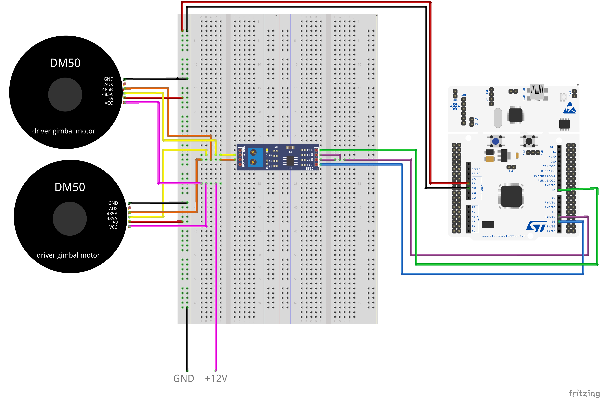

# Dual_Arm_Plotter
## Brief
이 프로젝트는 Palleral Scara Robot을 간단한 기구학만으로 구현한 것입니다.  
서울과학기술대학교의 임베디드 시스템 프로그래밍 수업의 텀 프로젝트의 일환으로 제작되었습니다.
## 사용 부품
|항목|품명|버전|
|---|---|---|
|보드|arm cortex-m nucleo| F401RE|
|펌웨어|mbed-os|2.0|
|모터|GYEMS DM50 2개|-|
 

## 실물
[Go to Youtube](https://www.youtube.com/watch?v=BTTwyRU6h7Y)  

## 회로도

